.. demos

*****
Demos
*****

You will need the following imports for the demos listed below:

.. code-block:: python

   import osyris
   import numpy as np
   import matplotlib.pyplot as plt

Demo 1 : Simple 2D slice
========================

Load output number 71 and create a 2D slice of the logarithm of density 100 au
wide through the data at ``z = 0`` centered around the highest density point,
with velocity vectors.

.. code-block:: python

   mydata = osyris.RamsesData(71, scale="au")
   osyris.plot_slice(mydata.log_rho, direction="z",
                     vec=mydata.velocity, dx=100)

.. image:: images/demo001.png
   :width: 700px

Demo 2 : Binning cells in a 2D histogram
========================================

Load output number 71 and create a 2D histogram of the number of cells in the
log(density)-log(T) plane.

.. code-block:: python

   mydata = osyris.RamsesData(71)
   osyris.plot_histogram(mydata.log_rho, mydata.log_T,
                         scalar_args={"cmap": "log"})

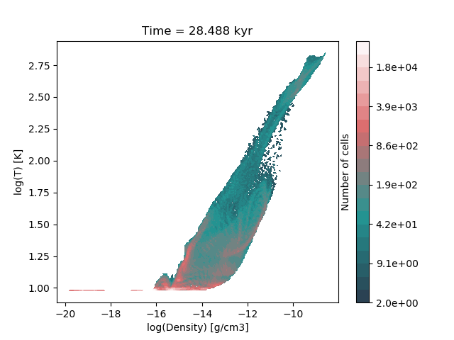

Demo 3 : New variable field and scatter plot
============================================

Load output number 71 and center it around ``[x, y, z] = [0.5, 0.5, 0.5]``.
Then create a 2D scatter plot of log(velocity) as a function of log(density).
We plot only one cell out of 100, use a new colormap which represents log(T),
and include a grey outline around all the data points.

.. code-block:: python

   mydata = osyris.RamsesData(nout=71, center=[0.5,0.5,0.5], scale="au")
   mydata.new_field(name="log_vel",
                    operation="np.log10(np.sqrt(velocity_x**2 +"
                              "velocity_y**2 + velocity_z**2))",
                    unit="cm/s", label="log(Velocity)")
   osyris.plot_histogram(mydata.log_rho, mydata.log_vel, scatter=mydata.log_T,
                         outline=True,
                         scatter_args={"iskip": 100,"cmap": "gnuplot"})

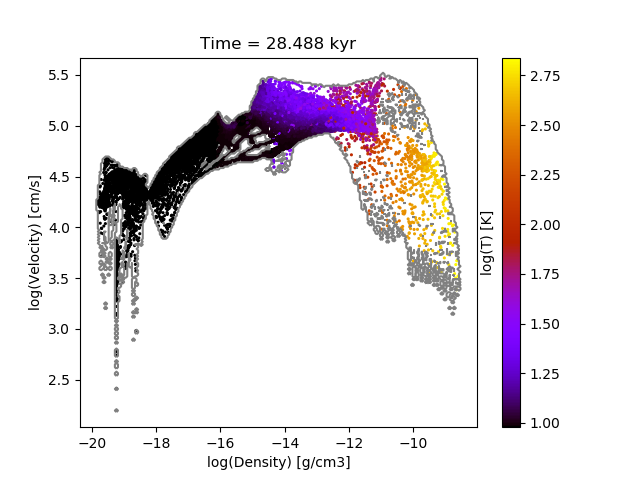

Demo 4 : Center domain around max density and plot slice with streamlines
=========================================================================

Load output number 71 and create a 2D slice of the logarithm of density 100 au
wide through the data at ``y = 0`` centered around the highest density point,
with the ``x`` axis along the horizontal direction, overlaying magnetic field
streamlines.
Color the streamlines logarithmically with a new colormap.
Set the time unit to yr.

.. code-block:: python

   osyris.config.default_values["time_unit"] = "yr"
   mydata = osyris.RamsesData(nout=71, center="max:density",
                              scale="au")
   osyris.plot_slice(mydata.log_rho, direction="yxz",
                     stream=mydata.B, dx=100,
                     stream_args={"cmap": "log,jet"})

.. image:: images/demo004.png
   :width: 700px

Demo 5 : Density slice at arbitrary angle with coloured velocity vectors
========================================================================

Load output number 71 and create a 2D slice of the logarithm of density 100 au
wide centered around the highest density point.
The direction of the slicing plane is specified by the normal vector to the
plane [-1,1,1]. Velocity vectors in km/s are overlayed.
Color the vectors with a new colormap and increase the number of vectors to be
plotted by decreasing the ``vskip`` value from its default ``9`` down to ``4``.
Finally add a colorbar for vectors.

.. code-block:: python

   mydata = osyris.RamsesData(nout=71, center="max:density",
                              scale="au")
   mydata.new_field(name="vkms", operation="velocity/1.0e5",
                    unit="km/s", label="Velocity")
   osyris.plot_slice(mydata.log_rho, direction=[-1,1,1],
                     vec=mydata.vkms, dx=100,
                     vec_args={"cmap": "jet", "vskip": 4, "cbar": True})

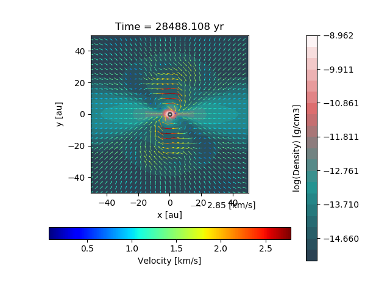

Demo 6 : Automatic "top" slice orientation according to angular momentum
========================================================================

Load output number 71 and create a 2D slice of the logarithm of density 100 au
wide through the data using automatic orientation based on the angular momentum
in the data.
This is useful for looking at disks.
Use the ``"auto:top"`` direction for the slice to view the disk from above.

.. code-block:: python

   mydata = osyris.RamsesData(nout=71, center="max:density",
                              scale="au")
   osyris.plot_slice(mydata.log_rho, direction="auto:top",
                     vec=mydata.velocity, dx=100)

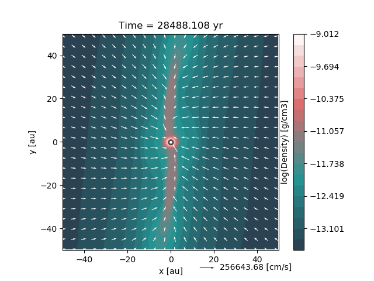

Demo 7 : Automatic "side" slice orientation according to angular momentum
=========================================================================

Same as above (demo 6) but use the ``direction="auto:side"`` for the slice to
view the disk from the side.

.. code-block:: python

   mydata = osyris.RamsesData(nout=71, center="max:density",
                              scale="au")
   osyris.plot_slice(mydata.log_rho, direction="auto:side",
                     vec=mydata.velocity, dx=100)

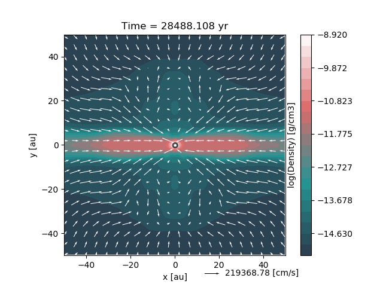

Demo 8 : Subplots, slices and contours
======================================

In this example, we create two subplot axes with ``matplotlib``.
We load output number 71,
setting the center as the mean position of all the cells with a density above
1.0e-10 g/cm3.
We also only load a cube of 20 AU in size,
instead of loading the entire data into the RAM.

Next, we create a velocity field in km/s for better plotting.
We then plot in the left panel the log of density as a coloured slice with kms
velocity vectors.
The minimum and maximum of log(density) is forced to -14 and -9, and we used 40
colours instead of the default 20.
We give the ``plot_slice`` call the axes to use via the ``axes`` argument.
The vectors are scaled to 2km/s, and the key is moved inside the axes.
Next, we overlay some custom chosen density contours with different line styles
and colours.

In the right panel,
we plot a slice of temperature and overlay some lightgray contours showing the
AMR levels.
We label the contours with ``"label":True`` and set the format to integers
with ``"fmt":"%i"``.

.. code-block:: python

   # Create figure
   fig = plt.figure(figsize=(15, 5.25))
   ax1 = fig.add_subplot(121)
   ax2 = fig.add_subplot(122)

   # Load data
   mydata = osyris.RamsesData(nout=71, center="av:density>1.0e-10",
                              scale="au", dx=20.0, dy=20.0, dz=20.0)

   # Create velocity field in km/s
   mydata.new_field(name="vkms", operation="velocity/1.0e5",
                    unit="km/s", label="Velocity")

   # Define region to plot
   dx = 15.0

   # Left plot: coloured density slice with overlayed contours
   osyris.plot_slice(mydata.log_rho, direction="z", dx=dx,
                     axes=ax1,
                     scalar_args={"extend": "both",
                                  "vmin": -14.0,
                                  "vmax": -9.0,
                                  "nc": 40},
                     vec=mydata.vkms,
                     vec_args={"vscale": 2.0,
                               "vkey_pos": [0.65,0.1]},
                     contour=mydata.log_rho,
                     contour_args={"levels": [-12.0,-11.0,-9.0],
                                   "colors": ('yellow','k',"lime"),
                                   "linewidths": [2,5,2],
                                   "linestyles": ["solid","dashed","solid"],
                                   "cmap": None,
                                   "cbar": False},
                     title="My title")

   # Right plot: temperature slice with AMR levels
   osyris.plot_slice(mydata.log_T, direction="z", dx=dx,
                     axes=ax2, title="",
                     scalar_args={"cmap": "hot"},
                     contour=mydata.level,
                     contour_args={"fmt": "%i",
                                   "colors": "lightgray",
                                   "cmap": None,
                                   "levels": range(12,20),
                                   "label": True,
                                   "cbar": False})

   # Save figure to pdf file
   fig.savefig("demo008.png")

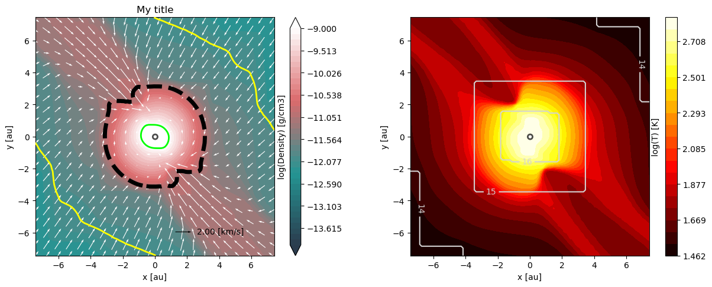

Demo 9 : Plot only a subset of cells belonging to a disk
========================================================

In this example, we select cells according to their density and plot only those.
This is done by creating a new field and using the numpy ``where`` function.
To combine more than one selection criteria, use the ``logical_and`` numpy
function.
**Note**: the argument ``only_leafs=False`` in ``get`` which is necessary here,
when creating a new field using the ``values`` argument.
This is useful for plotting disks around protostars, for example.
Here we select the cells with a density in the range
-12.5 < log(density) < -11.0.
After plotting the disk, we use 2 different methods to compute the disk mass.

.. code-block:: python

   # Load data
   mydata = osyris.RamsesData(nout=71, center="max:density",
                              scale="au", dx=100.0, dy=100.0,
                              dz=100.0)

   mydata.new_field(name="log_rho_disk",
                    values=np.where(np.logical_and(
                                    mydata.get("log_rho", only_leafs=False) > -12.5,
                                    mydata.get("log_rho", only_leafs=False) < -11.0),
                                    mydata.get("log_rho", only_leafs=False), np.NaN),
                    label="Disk density")

   osyris.plot_slice(mydata.log_rho_disk, direction="z", dx=50)

   # Now print disk mass: 2 different ways
   # Method 1:
   cube = np.where(np.logical_and(
                   mydata.get("log_rho") > -12.5,
                   mydata.get("log_rho") < -11.0))
   mcore1 = np.sum(mydata.get("mass")[cube])
   # Method 2:
   mydata.new_field(name="disk_mass",
                    values=np.where(np.logical_and(
                                    mydata.get("log_rho", only_leafs=False) > -12.5,
                                    mydata.get("log_rho", only_leafs=False) < -11.0),
                                    mydata.get("mass", only_leafs=False), np.NaN),
                    label="Disk mass")
   mcore2 = np.nansum(mydata.get("disk_mass"))
   print("Disk mass: %.3e Msun ; %.3e Msun"%(mcore1, mcore2))

This prints

.. code-block:: sh

   Disk mass: 2.010e-02 Msun ; 2.010e-02 Msun

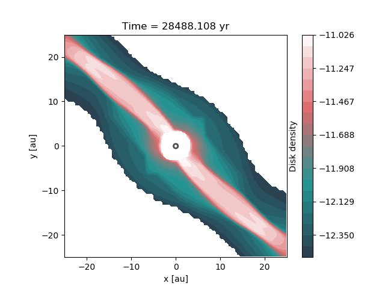

Demo 10 : Difference between two snapshots
==========================================

Here, we want to make a map of the difference in density between two snapshots.
Because we do not necessarily have the same number of cells at the same place,
we first have to make uniform 2D maps using the ``plot_slice`` function,
which we can then directly compare.
This is done by calling ``plot_slice`` with the arguments ``plot=False`` to
avoid making a plot, and ``copy=True`` to return the data to a variable.

.. code-block:: python

   # Read data from 2 snapshots
   mydata1 = osyris.RamsesData(71, scale="au")
   mydata2 = osyris.RamsesData(201, scale="au")

   # Extract log(density) slices by copying data into structures
   slice1 = osyris.plot_slice(mydata1.log_rho, direction="z",
                              dx=100, plot=False, copy=True)
   slice2 = osyris.plot_slice(mydata2.log_rho, direction="z",
                              dx=100, plot=False, copy=True)

   # Get coordinates
   x = slice1[0]
   y = slice1[1]

   # Get densities
   rho1 = slice1[2]
   rho2 = slice2[2]

   # Density difference
   diff = (rho1-rho2)/rho2

   # Create figure
   fig = plt.figure()
   ax1 = fig.add_subplot(111)
   im1 = ax1.contourf(x, y , diff, cmap='RdBu',
                      levels=np.linspace(-0.12,0.12,31))
   ax1.set_aspect("equal")
   cb = plt.colorbar(im1, ax=ax1)
   cb.ax.set_ylabel("Relative difference")

   fig.savefig("diff.png", bbox_inches="tight")

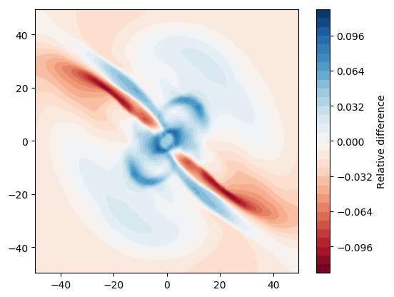

Demo 11 : ISM tables for equation of state (EOS), opacities and resistivities
=============================================================================

We load the EOS, opacities and resistivities tables and plot them as a function
of gas density.

.. code-block:: python

   # Create figure
   fig = plt.figure(figsize=(20, 5))
   ax1 = fig.add_subplot(131)
   ax2 = fig.add_subplot(132)
   ax3 = fig.add_subplot(133)

   # Load data
   mydata = osyris.RamsesData(nout=71, scale="au",
                              verbose=True)

   # Create a properly dimensioned field for internal energy
   conv = (mydata.info["unit_l"] / mydata.info["unit_t"])**2
   mydata.new_field(name="internal_energy",
                    operation="passive_scalar_4*density*" + str(conv),
                    unit="erg/cm3",
                    label="Internal energy")

   # Read EOS table and plot sound speed histogram
   osyris.ism_physics.get_eos(mydata, fname="SCvH_eos.dat")
   mydata.new_field(name="log_cs", operation="np.log10(cs_eos)",
                    label="log(cs)", unit="cm/s")
   osyris.plot_histogram(mydata.log_rho, mydata.log_cs,
                         scalar_args={"cmap": "log,Greens",
                                      "cbar": False},
                         outline=True, axes=ax1,
                         title="Equation of state")

   # Read opacity table and plot Rosseland mean opacity
   osyris.ism_physics.get_opacities(mydata)
   mydata.new_field(name="log_kr", operation="np.log10(kappa_r)",
                    label="log(Kr)", unit="cm2/g")
   osyris.plot_histogram(mydata.log_T, mydata.log_kr,
                         scalar_args={"cmap": "log,Blues",
                                      "cbar": False},
                         outline=True, axes=ax2,
                         title="Opacities")

   # Read resistivity table and plot Ohmic and Ambipolar
   osyris.ism_physics.get_resistivities(mydata)
   mydata.new_field(name="log_etaO", operation="np.log10(eta_ohm)",
                    label="log(etaO)")
   mydata.new_field(name="log_etaA", operation="np.log10(eta_ad)",
                    label="log(etaA)")
   osyris.plot_histogram(mydata.log_rho, mydata.log_etaO,
                         scalar_args={"cmap": "log,Greys",
                                      "cbar": False},
                         outline=True, axes=ax3, title="")
   osyris.plot_histogram(mydata.log_rho, mydata.log_etaA,
                         scalar_args={"cmap": "log,Reds",
                                      "cbar": False},
                         outline=True, axes=ax3,
                         title="Resistivities")
   ax3.set_ylabel("log(eta) [s]")
   ax3.text(-16.0,0.0, "Ambipolar", va="center", ha="center")
   ax3.text(-12.0,-4.0, "Ohmic", va="center", ha="center")

   fig.savefig("ism_tables.png", bbox_inches="tight")

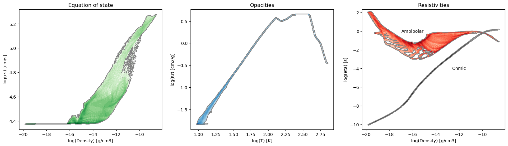

Demo 12 : Make a thick slice
============================

We want to plot the average value of density inside a slice with a thickness of
20 AU.
For this, we use the ``plot_column_density`` function with the ``summed=False``
option.
We also set the number of samples along the slice thickness direction to 5
using ``nz=5`` to speed up the process (by default ``nz`` equals the resolution
in x and y).
We also plot velocity vectors which are the average of the velocity field along
the line of sight.
**Remember** to check for convergence by increasing ``nz`` to make sure you
have similar results with a lower ``nz``.

.. code-block:: python

   mydata = osyris.RamsesData(nout=71, center="max:density", scale="au")
   osyris.plot_column_density(scalar=mydata.density,
                              direction="z", vec=mydata.velocity,
                              dx=100, dz=20,
                              scalar_args={"cmap": "log"},
                              nz=5, summed=False)

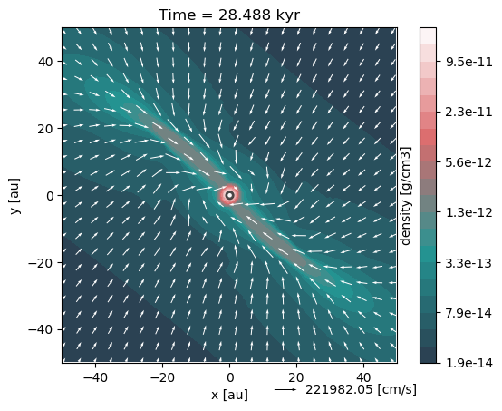

Demo 13 : Slice above the origin
================================

We want to plot a slice of density but through a point which is 5 AU above the
centre of the domain, defined as the cell with the highest density.
This is done by setting the ``origin`` coordinate to ``[0,0,5]``.

.. code-block:: python

   mydata = osyris.RamsesData(nout=71, center="max:density", scale="au")
   osyris.plot_slice(scalar=mydata.density, direction="z",
                     vec=mydata.velocity, dx=100, origin=[0,0,5],
                     scalar_args={"cmap": "log"}, fname="demo013.png")

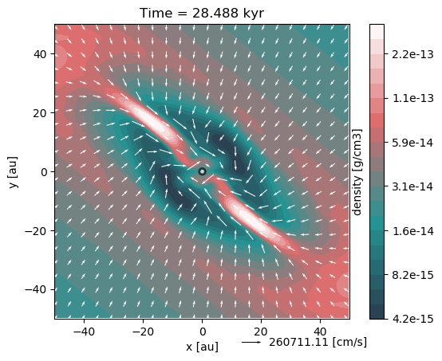

Demo 14 : Make a histogram with mass colormap
=============================================

Here we create a histogram of log(density) vs log(temperature) using the mass
contained in each pixel as the colormap.
We want to sum the mass in each pixel, so we use the option ``summed=True``.

.. code-block:: python

   mydata = osyris.RamsesData(nout=71, center="max:density", scale="au")
   osyris.plot_histogram(mydata.log_rho, mydata.log_T, mydata.mass,
                         summed=True, scalar_args={"cmap": "magma_r,log"},
                         outline=True, fname="demo014.png")

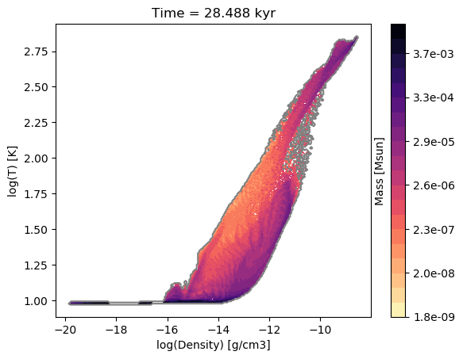

Demo 15 : Demo from the README with histogram and slice subplots
================================================================

We make six subplots.

.. code-block:: python

   # Load data
   mydata = osyris.RamsesData(nout=71, center="max:density", scale="au")

   # Create figure
   fig = plt.figure(figsize=(20, 10))
   ax1 = fig.add_subplot(231)
   ax2 = fig.add_subplot(232)
   ax3 = fig.add_subplot(233)
   ax4 = fig.add_subplot(234)
   ax5 = fig.add_subplot(235)
   ax6 = fig.add_subplot(236)

   # Density vs B field with AMR level contours
   osyris.plot_histogram(mydata.log_rho, mydata.log_B, axes=ax1,
                         scalar=True, scalar_args={"cmap": "log,YlGnBu"},
                         contour=mydata.level,
                         contour_args={"fmt": "%i", "label": True,
                                       "colors": "k", "cmap": None,
                                       "levels": range(5,20), "cbar": False})

   # Create new field with log of velocity
   mydata.new_field(name="log_vel",
                    operation="np.log10(np.sqrt("
                              "velocity_x**2+velocity_y**2+velocity_z**2))",
                    unit="cm/s", label="log(Velocity)")

   # Density vs log_vel in scatter mode with a grey outline
   osyris.plot_histogram(mydata.log_rho, mydata.log_vel, axes=ax2,
                         scatter=mydata.log_T, outline=True,
                         scatter_args={"iskip": 100, "cmap": "gnuplot"})

   #x,z density slice with B field streamlines
   osyris.plot_slice(mydata.density, direction="yxz", stream=mydata.B,
                     dx=100, axes=ax3, scalar_args={"cmap": "log"})
   # x,y density slice with velocity vectors in color
   osyris.plot_slice(scalar=mydata.log_rho, direction="z",
                     vec=mydata.velocity, dx=100, axes=ax4,
                     vec_args={"cmap": "seismic", "vskip": 4})
   # x,y temperature slice with velocity vectors
   osyris.plot_slice(mydata.log_T, direction="z", vec=mydata.velocity,
                     dx=100, axes=ax5, scalar_args={"cmap":"hot"},
                     contour=mydata.level,
                     contour_args={"fmt": "%i", "label": True,
                                   "colors": "w", "cmap": None,
                                   "levels": range(9,17)})

   # Now update values with later snapshot
   mydata.update_values(201)
   # Re-plot x,y density slice with velocity vectors
   osyris.plot_slice(mydata.log_rho, direction="auto:top",
                     vec=mydata.velocity, dx=100, axes=ax6)

   fig.savefig("demo015.png", bbox_inches="tight")

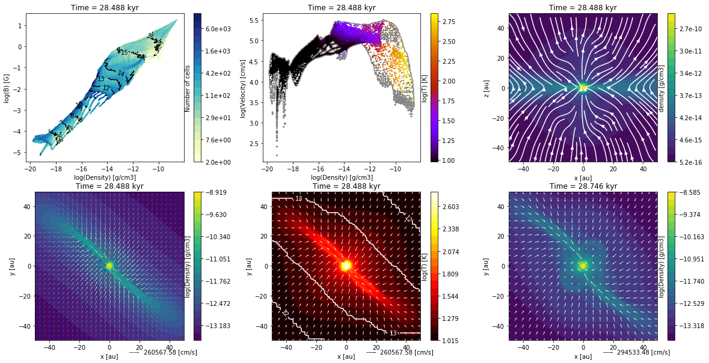

Demo 16 : Color slice vectors with custom field
===============================================

We plot a log10(Density) scalar field.
We overlay vectors that represent the magnetic field direction but are coloured
with the magnitude of the velocity instead of the B field.
We first create a new field to represent the velocity in km/s ``mydata.vkms``.
Then we set ``"colors":mydata.vkms`` in ``vec_args``.
We remove the arrow heads by setting ``"headwidth":1,"headlength":0``.
We want all vector segments to have the same length, so we normalize them with
``"normalize_arrows":True``,
and we make them a little thicker with ``"width":0.01``.

**Warning**: in ``vec_args``, ``colors`` is for a new field for the colormap,
whereas ``color`` is a single color (e.g. ``'white'``) for coloring the arrows.

.. code-block:: python

   mydata = osyris.RamsesData(nout=71, center="max:density", scale="au")
   mydata.new_field(name="vkms", operation="velocity/1.0e5",
                    unit="km/s", label="Velocity")
   osyris.plot_slice(scalar=mydata.log_rho, direction="yxz",
                     vec=mydata.B, dx=100,
                     scalar_args={"cmap": "Blues"},
                     vec_args={"cmap":"YlOrRd", "colors": mydata.vkms,
                               "normalize_arrows": True, "vkey": False,
                               "scale": 25.0, "cbar": True, "width": 0.01,
                               "headwidth": 1, "headlength":0},
                     fname="demo016.png")

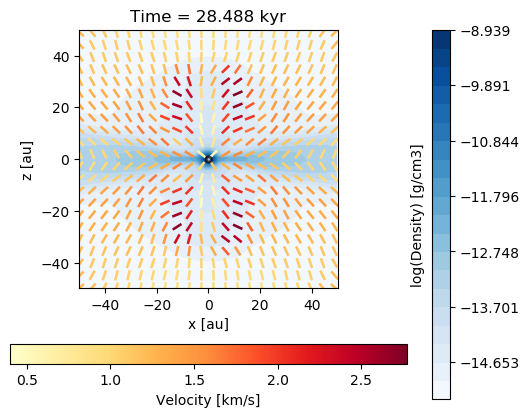

Demo 17 : Radial profile
========================

We can use the ``plot_histogram`` function to create a radial density profile.
The radial coordinate ``r`` and its logarithm ``log_r`` are by default
calculated when a ``RAMSES`` output is loaded.
By plotting the density as a function of radius as a scatter plot in
``plot_histogram``, we get the figure below (``iskip`` is used to plot 1 in
every 100 points to limit the size of the figure).
We also overlay the mean radial profile by binning the data radially and
computing the mean density in each bin.
This is drawn on the figure using the usual ``matplotlib`` plotting functions.
**Note** that the mean profile uses the full data set,
not just one in every 100 points.

.. code-block:: python

   # Load data
   mydata = osyris.RamsesData(nout=71, center="max:density", scale="au")

   # Create figure
   fig = plt.figure()
   ax = fig.add_subplot(111)

   # Make scatter plot as radial profile
   osyris.plot_histogram(mydata.log_r, mydata.log_rho, scatter=True,
                         scatter_args={"iskip": 100, "c": "grey"},
                         axes=ax)

   # Now overlay mean profile

   # Define min and max range
   rmin = -1.0
   rmax = 4.0

   # Number of points
   nr = 200

   # Radial bin edges and centers
   re = np.linspace(rmin,rmax,nr+1)
   log_r = np.zeros([nr])
   for i in range(nr):
       log_r[i] = 0.5*(re[i]+re[i+1])

   # Modify r values so that the central cell is not "-inf"
   r = np.where(np.isinf(mydata.log_r.values),-2.0,mydata.log_r.values)

   # Bin the data in radial bins
   z0, edges = np.histogram(r, bins=re)
   z1, edges = np.histogram(r, bins=re, weights=mydata.density.values)
   rho_mean = np.log10(z1 / z0)

   # Overlay profile
   ax.plot(log_r, rho_mean, color="r", lw=3, label="Mean profile")
   ax.legend()

   fig.savefig("demo017.png", bbox_inches='tight')

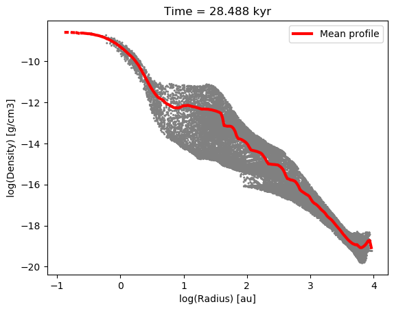
