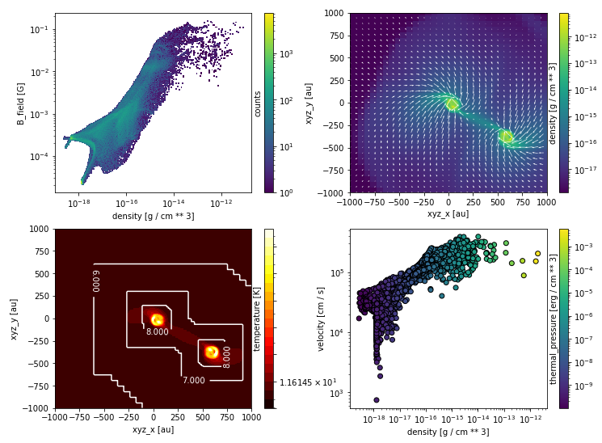

.. osyris documentation master file, created by
   sphinx-quickstart on Mon Jul 15 16:29:19 2019.
   You can adapt this file completely to your liking, but it should at least
   contain the root `toctree` directive.

*********************************
Osyris - Visualization for Ramses
*********************************

Osyris is a python utility to read, manipulate and visualize simulation data
created by the astrophysical software
`Ramses <https://bitbucket.org/rteyssie/ramses>`_.
Osyris provides automatic handling of physical units,
loading of sub-regions inside a large simulation,
and enables the production of publication grade figures.

It was designed to be portable, lightweight and fast,
requiring minimum dependencies and resources.
It currently only works with the native ``binary`` Ramses data output format.
It uses `Numpy <https://numpy.org>`_ for data
manipulation, `Pint <https://pint.readthedocs.io>`_ for physical units,
and `Matplotlib <https://matplotlib.org/stable/>`_ for visualization.

Installation
============

.. toctree::
   :maxdepth: 2

   installation

Basics
======

.. toctree::
   :maxdepth: 2

   basics

Configuration
=============

.. toctree::
   :maxdepth: 2

   configuration

Data structures
===============

.. toctree::
   :maxdepth: 2

   data_structures

Loading data
============

.. toctree::
   :maxdepth: 2

   loading_data

Plotting: 1D and 2D data
========================

.. toctree::
   :maxdepth: 2

   plotting_1d_2d

Plotting: histograms
====================

.. toctree::
   :maxdepth: 2

   plotting_histograms

Plotting: spatial maps
======================

.. toctree::
   :maxdepth: 2

   plotting_maps

Plotting: thick maps
====================

.. toctree::
   :maxdepth: 2

   plotting_thick_maps

Plotting: scatter plots
=======================

.. toctree::
   :maxdepth: 2

   plotting_scatter

Plotting: particles
===================

.. toctree::
   :maxdepth: 2

   plotting_particles

Recipes
=======

.. toctree::
   :maxdepth: 2

   recipes

API
===

.. toctree::
   :maxdepth: 2

   api

Support
=======

.. toctree::
   :maxdepth: 2

Indices and tables
==================

* :ref:`genindex`
* :ref:`modindex`
* :ref:`search`
